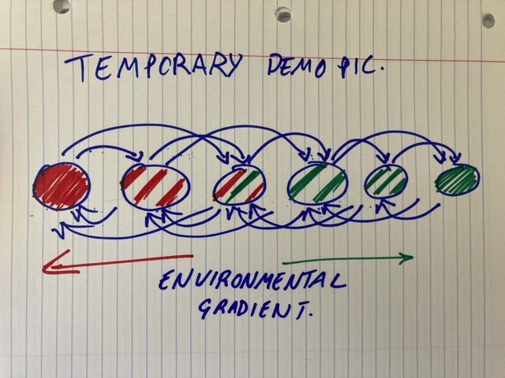

## Simulating samples to generate datasets for the BIOL525D Bioinformatics Workshop

We want to simulate quasi-realistic data to use for demonstration purposes in the BIOL525D Bioinformatics Workshop.

The directory ```slim_configs/``` contains the SLiM configuration scripts that model a a scenario of local adaptation in a 1D stepping stone model.

The model was **motivated** by the Chinook Salmon here in British Columbia. Salmon are anadromous and migrate out to sea when young and return to their home stream or river to spawn. This homing ability is one of nature's many marvels, but it is not perfect. A small proportion of salmon get lost and can end up in other streams (e.g. Unwin and Quinn 1993). To model such straying behaviour, I include a small amount of migration between neighbouring streams, so that an individual is very likely to end up back in it home stream, but that a small number will return to neighbouring streams. This results in a small amount of gene flow between neighbouring streams.

I include environmental heterogeneity in the simulation, so that some populations  experience colder temperatures and some experience warmer temperatures. Below is a cartoon of the situation we are simulation. I appreciate that this is an overly simplified model. **The purpose here is not really to have a good match to reality, but to have a model that students and workshop participants can readily visualise and understand.**



I used the actual genomic sequence of Chinook salmon as a template for the SLiM simulations. Each fish has a single quantitative trait that is under Gaussian stabilising selection. I used distribution of CDS from genes present in the salmon annotation to make the map of annotations in the simulation.

I ran an individual simulation replicate (this takes about an hour on my Desktop computer which is reasonably good) as follows:

```
mkdir Run1
cd Run1
slim -d REP=1 ../slim_configs/chinook_ReferenceGenome.noIntergenic.slim
cd ../
```

If you take a look at the config file you'll note that the only genomic elements that are defined are those that correspond to QTL. The reason I did it that way is so that I did not have to model neutral mutations in intergenic regions. That's quite computationally expensive and I didn't really want to muck around with that. In lieu of that, I add neutral mutations in intergenic space uisng the PySLiM/tskit/msprime workflow.

If you don't want to muck around with the tree seuqence, you can run:

```
mkdir Run1
cd Run1
slim -d REP=1 ../slim_configs/chinook_ReferenceGenome.slim
cd ../
```
This will take a lot longer, as many mutations will be being tracked.

With VCF and a list of substitutions from the simulation, I use the script ```bin/slim_2_fasta.py``` to generate a FASTA file from individuals in the SLiM output.

The FASTA files then represent an individual's genome and can be used to simulate sequencing reads.
